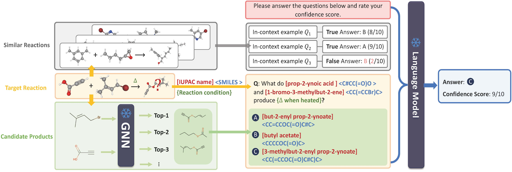

# ReLM: Leveraging Language Models for Enhanced Chemical Reaction Prediction

EMNLP 2023 \[[paper](https://arxiv.org/abs/2310.13590v1)\]

Authors: Yaorui Shi, An Zhang, Enzhi Zhang, Zhiyuan Liu, Xiang Wang

This repository contains the official code impementation for the paper **ReLM: Leveraging Language Models for Enhanced Chemical Reaction Prediction**.



## Installation

```bash
conda create -n ReLLM python=3.8
conda activate ReLLM
pip install -r requirements.txt
```

## Reproducing results

To reproduce the results, you may need to run the bash scripts in the scripts folder:
```bash
sh scripts/run_Imidazo.sh
sh scripts/run_NiCOlit.sh
sh scripts/run_Rexgen30k.sh
sh scripts/run_Rexgen40k.sh
```

## Citation
```latex
@inproceedings{
    ReLM,
    title        = {{R}e{LM}: Leveraging Language Models for Enhanced Chemical Reaction Prediction},
    author       = {Shi, Yaorui and Zhang, An and Zhang, Enzhi and Liu, Zhiyuan and Wang, Xiang},
    booktitle    = {Findings of the Association for Computational Linguistics: {EMNLP}
                  2023, Singapore, December 6-10, 2023},
    pages        = {5506--5520},
    publisher    = {Association for Computational Linguistics},
    year         = {2023},
    url          = {https://aclanthology.org/2023.findings-emnlp.366}
}
```
